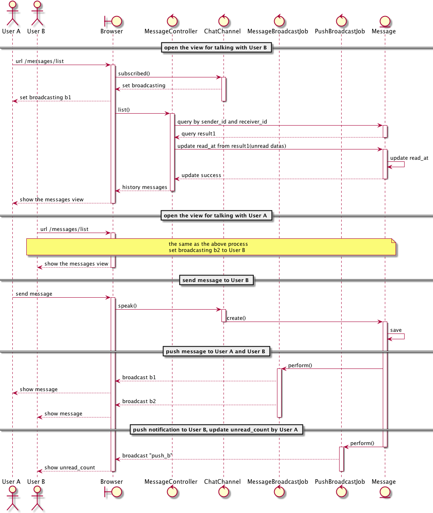
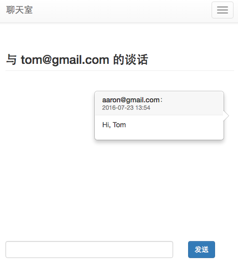
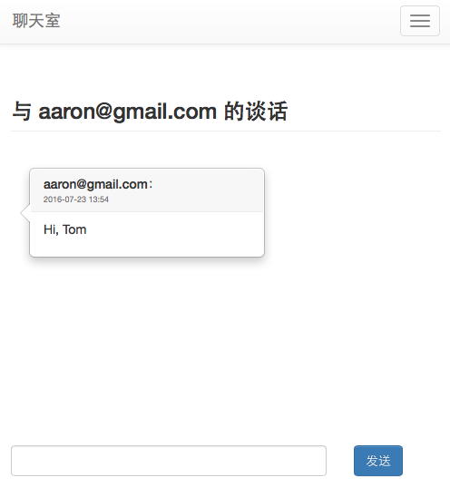
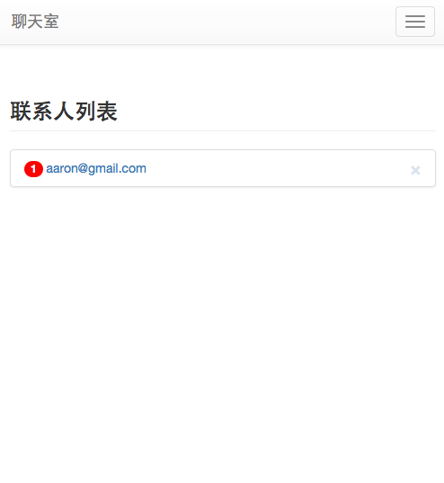

# Chat Room
实时聊天系统

# 功能列表
- 注册登录
- 添加联系人
- 用户之间可以实时的收发信息
- 联系人列表显示用户的 id 以及未读消息的数量
- 删除联系人

# Dependencies
- ruby 2.3.0
- rails 5.0.0

# 消息推送交互顺序图

# 截图

# todo
- 添加联系人时，需要对方验证
- 聊天室权限控制
- 联系人在线状态显示
- 撤销 1分钟内发的消息
